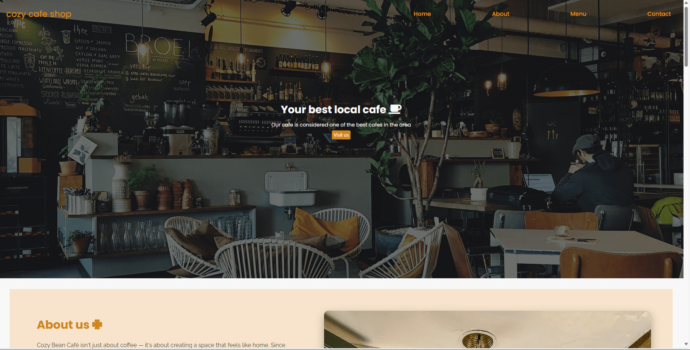
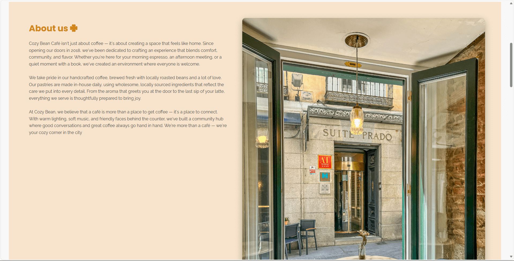
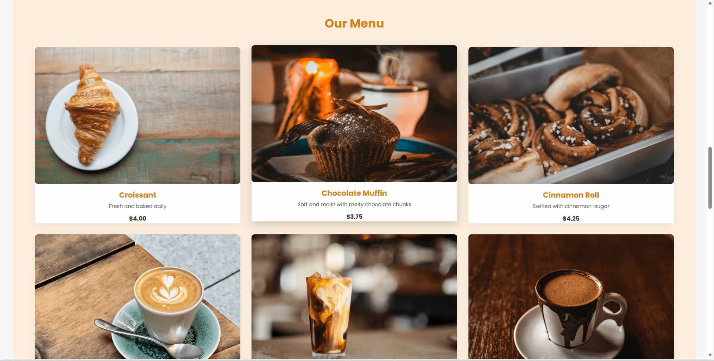
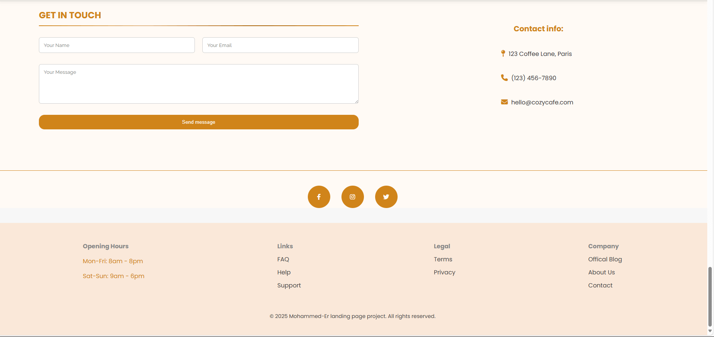

# Cozy Cafe Landing Page ☕

A simple and cozy responsive landing page for a fictional cafe.

## 🔧 Technologies Used
- HTML
- CSS (Flexbox + Grid)
- Js 
- Google Fonts
- FontAwesome Icons

## 🔍 Live Preview
[Live Demo](https://mohammed-er.github.io/Cafe-landing-page/)

## 📸 Screenshots

## ✨ Features
- Responsive design
- Smooth scroll navigation
- About, Menu, and Contact sections
